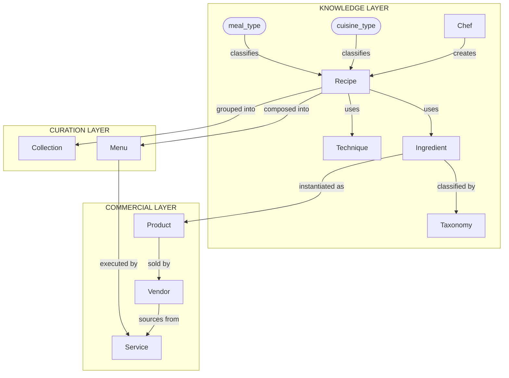

# Ummi Markup Format (UMF) — Specification Repository

This repository captures the **Ummi Markup Format (UMF)** specification as a self-contained, professional-grade reference implementation.

UMF is an **open, schema-versioned data standard** for representing culinary knowledge as a **typed knowledge graph**, not a document.

## 📌 What’s Included

- ✅ **JSON Schema artifacts** for UMF entity types (recipes, ingredients, techniques, etc.)
- ✅ **Documentation** extracted from https://umfspec.org/
- ✅ Scripts to **fetch / refresh** the schema artifacts directly from the live website
- ✅ Standard open-source repository infrastructure (LICENSE, CONTRIBUTING, CI templates)

## 🚀 Getting Started

### 1) Install dependencies

```bash
python -m venv .venv
.venv\Scripts\activate
pip install -r requirements.txt
```

### 2) Fetch the latest schemas from https://umfspec.org

```bash
python scripts/fetch_schemas.py
```

This will populate `schemas/` with the canonical JSON Schema definitions.

### 3) Validate example documents

```bash
python scripts/validate_recipe.py examples/recipe-example.json
```

## 🗂 Project Layout

- `schemas/` — Canonical UMF JSON Schema files
- `docs/` — Spec documentation extracted from umfspec.org
- `scripts/` — Helpers & tooling (schema fetching, validation)

## � UMF Knowledge Graph (ERD)



## �🔖 License

This repo is released under **CC BY 4.0** (same as the original UMF spec).

---

📌 This repository is intended as a canonical, community-friendly home for the UMF standard.
If you want to propose changes, please open an issue or a pull request.
