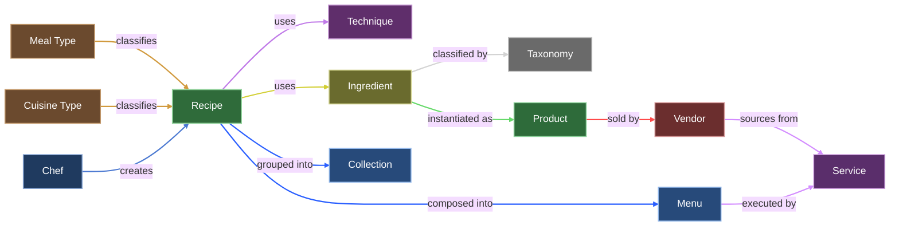

# UMF Specification

Ummi Markup Format (UMF) is an open, schema-versioned standard for representing culinary knowledge as a typed knowledge graph.

UMF is designed for builders who need recipe data that is interoperable, testable, and reusable across products.

## Why UMF Exists

Most recipe formats are document-like and hard to compose across systems.

UMF treats culinary knowledge as structured entities and relationships so teams can:

- Share data between apps without brittle transformations.
- Track provenance, adaptations, and lineage explicitly.
- Build deterministic dietary and taxonomy logic.
- Evolve models through versioned schemas instead of ad hoc payload drift.

## Core Model

UMF currently defines nine first-class entities:

- `recipe`
- `ingredient`
- `technique`
- `chef`
- `collection`
- `menu`
- `product`
- `vendor`
- `service`

Relationships between these entities encode how culinary knowledge is created, organized, and operationalized.

## UMF Knowledge Graph

## Example Payload

See [examples/recipe-example.json](./examples/recipe-example.json) for a reference document.

## How To Adopt UMF

1. Choose a release tag.
2. Use schemas from `schemas/` for that tag.
3. Validate producer and consumer payloads in CI with a Draft 2020-12 compatible validator.
4. Upgrade intentionally between schema versions.

## Versioning

UMF uses semantic intent:

- Patch: editorial/non-breaking fixes.
- Minor: backwards-compatible additions.
- Major: breaking changes with migration impact.

## Repository Layout

- `schemas/`: JSON Schema artifacts.
- `docs/`: specification and governance docs.
- `examples/`: sample UMF documents.

## Contributing

- Contribution guide: [CONTRIBUTING.md](./CONTRIBUTING.md)
- Governance: [docs/governance.md](./docs/governance.md)
- Code of conduct: [CODE_OF_CONDUCT.md](./CODE_OF_CONDUCT.md)

## License

Released under [CC BY 4.0](./LICENSE).
