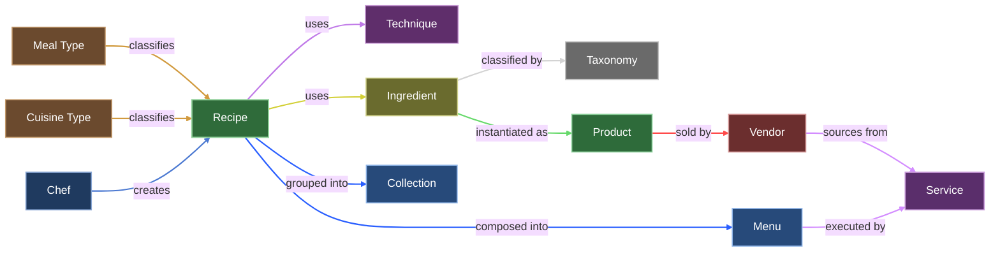

# UMF Specification

Canonical schemas and governance for the Ummi Markup Format (UMF).

UMF is an open, schema-versioned data standard for representing culinary knowledge as a typed knowledge graph.

## Repository Contract

This repository is the source of truth for UMF schemas and specification docs.

- `main` and tagged releases are canonical.
- `umfspec.org` is a publication target built from this repository.
- If the website and repository ever diverge, the repository wins.

## What Is In This Repository

- Canonical JSON Schema artifacts for all UMF entity types.
- Human-readable specification docs and governance notes.
- Example payloads for implementation guidance.
- Open-source project infrastructure for contribution and review.

## What Is Not In This Repository

- No schema scraping or sync scripts from the website.
- No generated artifacts that cannot be traced to commits and releases.
- No hidden canonical source outside git.

## Entity Coverage

UMF currently defines nine first-class entity schemas:

- `recipe`
- `ingredient`
- `technique`
- `chef`
- `collection`
- `menu`
- `product`
- `vendor`
- `service`

## UMF Knowledge Graph

## Repository Layout

- `schemas/`: Canonical JSON Schema files.
- `docs/`: Specification and governance documentation.
- `examples/`: Example UMF JSON documents.

Important references:

- Schema guide: [schemas/README.md](./schemas/README.md)
- Governance model: [docs/governance.md](./docs/governance.md)

## How To Use The Schemas

Use any JSON Schema Draft 2020-12 compatible validator in your runtime or CI pipeline.

Recommended consumption model:

1. Pin to a release tag.
2. Vendor or reference the schema files from that tag.
3. Validate producer and consumer payloads in CI.
4. Upgrade intentionally between schema versions.

## Change Model

All schema changes must flow through pull requests.

Required for schema PRs:

1. Clear rationale in the PR description.
2. Compatibility impact statement.
3. Example payload changes when behavior changes.
4. Documentation updates in `docs/` when semantics change.

## Versioning And Releases

UMF follows explicit schema versioning.

- Patch: editorial fixes or non-breaking clarifications.
- Minor: backwards-compatible additive schema changes.
- Major: breaking changes requiring migration.

Every released version should map to:

- A git tag.
- A stable schema set in `schemas/`.
- A matching website publication.

## Publication Policy

`umfspec.org` should publish from tagged releases of this repository.

Suggested publication pattern:

1. Merge approved PR into `main`.
2. Create release tag.
3. Publish site artifacts from that exact tag.
4. Keep versioned schema URLs immutable.

## Contributing

Contribution guide: [CONTRIBUTING.md](./CONTRIBUTING.md)

Code of conduct: [CODE_OF_CONDUCT.md](./CODE_OF_CONDUCT.md)

## License

Released under [CC BY 4.0](./LICENSE).
